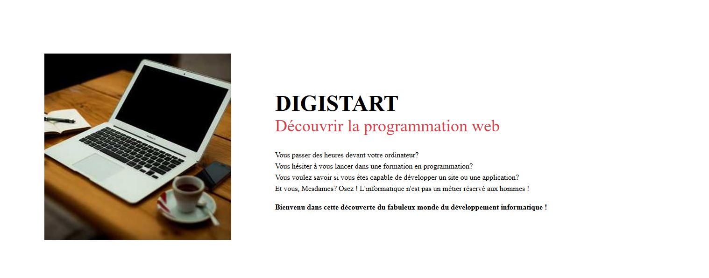

# Portfolio personnel

## 📝 Description
Portfolio web personnel présentant mes compétences en développement web
et quelques projets réalisés.

## 🌐 Démo en ligne
👉 https://MikeTD24.github.io/mon-portfolio/

## 🛠️ Technologies utilisées
- HTML
- CSS
- JavaScript

## 🎯 Objectifs du projet
- Créer un site vitrine clair et responsive
- Mettre en pratique les bases du développement web
- Présenter mes projets et compétences

## 📸 Aperçu

## 🚀 Lancer le projet en local
Ouvrir le fichier `index.html` dans un navigateur
